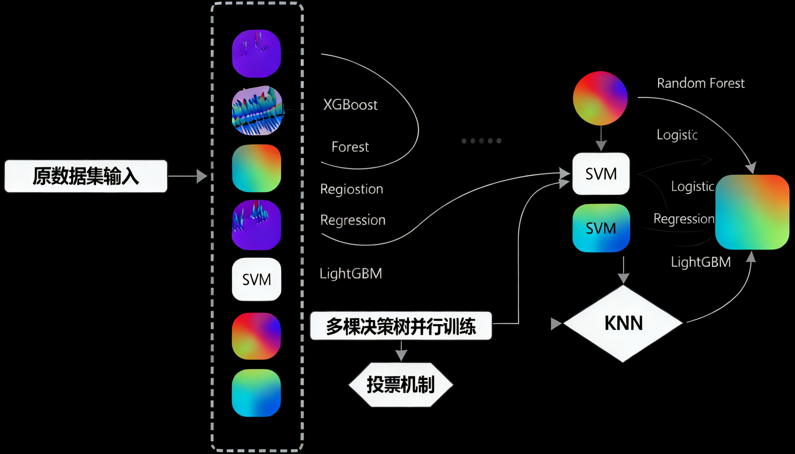

# CreditPredictionAlgorithm (CPA)




**CPA** 是一个用于 **贷款违约预测** 的机器学习算法封装工具。  
它基于 `scikit-learn`、`xgboost` 等框架，支持多种分类算法，提供了统一的训练、保存、加载和预测接口。  

## ✨ 功能特点
- 自动加载训练集 & 测试集
- 自动特征选择（`SelectKBest`）
- 封装多种分类模型：XGBoost、RandomForest、Logistic Regression、SVM（可扩展）
- 支持交叉验证、超参数搜索（Hyperopt）
- 支持模型保存 & 加载 & 参数更新
- 统一接口：
  - `train_xxx()` 训练模型  
  - `save_model()` 保存模型  
  - `load_model()` 加载模型 & 修改参数  
  - `predict_test()` 在测试集上预测  
  - `predict_single()` 单样本预测
 

## 📦 安装依赖

```bash
pip install 
numpy
pandas
scikit-learn
xgboost
lightgbm
hyperopt
joblib
matplotlib
seaborn
tqdm
```

## 🚀 使用示例

### 1. 初始化 & 加载数据
```python
from src.model import CreditModelPipeline

pipeline = CreditModelPipeline(
    train_path="train.csv",
    test_path="test.csv"
)

pipeline.load_train_data()
```

### 2. 训练 & 保存模型
```python
# XGBoost
xgb_model = pipeline.train_xgb(n_estimators=50, max_depth=6, learning_rate=0.1)
pipeline.save_model(xgb_model, "XGB.model")

# Random Forest
rf_model = pipeline.train_RandomForest_Classifier(n_estimators=100, max_depth=8)
pipeline.save_model(rf_model, "RF.model")

# Logistic Regression
lr_model = pipeline.train_logistic_regression(degree=1, penalty="l2", C=1.0)
pipeline.save_model(lr_model, "LR.model")

# SVM
svm_model = pipeline.train_svm(kernel="linear", C=1.0)
pipeline.save_model(svm_model, "SVM.model")
```
### 3. 加载 & 修改参数

```python
xgb_loaded = pipeline.load_model("XGB.model", params={"XGBR__n_estimators": 200})
rf_loaded  = pipeline.load_model("RF.model", params={"RF__max_depth": 10})
lr_loaded  = pipeline.load_model("LR.model", params={"LR__C": 0.5})
svm_loaded = pipeline.load_model("SVM.model", params={"SVC__C": 2.0})
```

### 4. 预测数据集
```python
result_df = pipeline.predict_test(["XGB.model", "RF.model", "LR.model", "SVM.model"])
print(result_df.head())

输出示例：

id   XGB_PRE   RF_PRE   LR_PRE   SVM_PRE
0  1    0.1234    0.2123   0.5432   0.6543
1  2    0.4321    0.3312   0.6212   0.4890

```

### 5. 单个样本预测
```python
sample = {
    "loanAmnt": 15000,
    "term": 36,
    "interestRate": 12.5,
    "grade": "B",
    "subGrade": "B3",
    "employmentLength": 10,
    "issueDateDT": 3650,
    # ... 其他训练时选中的特征
}

model = pipeline.load_model("XGB.model")
score = pipeline.predict_single(model, sample)
print("单个样本预测违约概率:", score)
```

## 🔧 扩展：支持更多模型

你可以很方便地扩展新的算法，例如 **LightGBM**、**KNN**：

```python
def train_lgb(self, **kwargs):
    from lightgbm import LGBMClassifier
    return Pipeline([
        ("scaler", MinMaxScaler()),
        ("LGB", LGBMClassifier(**kwargs))
    ])

def train_knn(self, n_neighbors=5):
    from sklearn.neighbors import KNeighborsClassifier
    return Pipeline([
        ("scaler", MinMaxScaler()),
        ("KNN", KNeighborsClassifier(n_neighbors=n_neighbors))
    ])

# 训练 & 保存
lgb_model = pipeline.train_lgb(n_estimators=200, learning_rate=0.05)
pipeline.save_model(lgb_model, "LGB.model")

# 预测整个测试集
result_df = pipeline.predict_test(["LGB.model"])
print(result_df.head())

# 单个样本预测
sample = {
    "loanAmnt": 15000,
    "term": 36,
    "interestRate": 12.5,
    "grade": "B",
    "subGrade": "B3",
    "employmentLength": 10,
    "issueDateDT": 3650,
    # ⚠️ 需包含训练时选中的所有特征
}

model = pipeline.load_model("LGB.model")
score = pipeline.predict_single(model, sample)
print("单个样本预测违约概率:", score)
```
